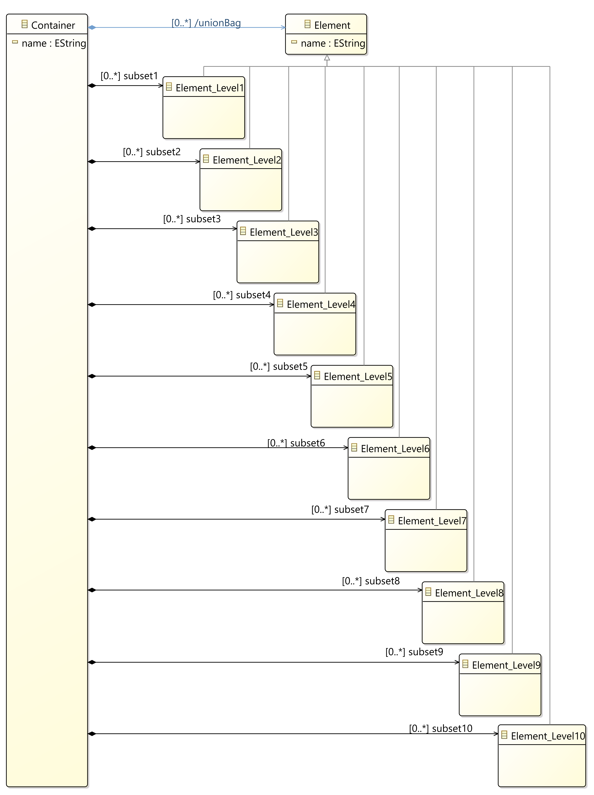

# Example model "SubsetUnion"

The functionality of the subset union implementation of MDE4CPP will be demonstrated in this example. The main implementation is located in the annotation 'prepareApplication' using the key 'sourceCodeMain'. The algorithm creates an object for each 'Element_Level' class and puts it only into the appropriate subset. The content of all subsets and the union will be printed out.

To create the gradle project use:

> gradlew generateModel -PModel=%MDE4CPP_HOME%/src/examples/commonExamples/SubsetUnionExample/SubsetUnion/model/subsetUnion.ecore

or

> generate

in the model folder.

To compile the example use:

> gradlew buildSubsetUnion



Result:
```
Printing out subset of level 1
Container name:
Name: Element1
-------------------
Printing out subset of level 2
Container name:
Name: Element2
-------------------

...

-------------------
Printing out subset of level 10
Container name:
Name: Element10
-------------------
Printing out the Union. Size: 11
Name: Element0
Name: Element1
Name: Element2
Name: Element3
Name: Element4
Name: Element5
Name: Element6
Name: Element7
Name: Element8
Name: Element9
Name: Element10
-------------------
```
